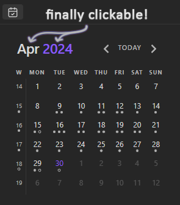

### About

The original **[obsidian-calendar-plugin](https://github.com/liamcain/obsidian-calendar-plugin)** by Liam Cain sadly hasn't been updated in years. 

This modified version makes month and year labels on calendars interactive - clicking on them opens respective monthly/yearly note. Works with **[obsidian-periodic-notes](https://github.com/liamcain/obsidian-periodic-notes)**.

### Installation

Just replace the original main.js in `.obsidian/plugins/calendar` 
